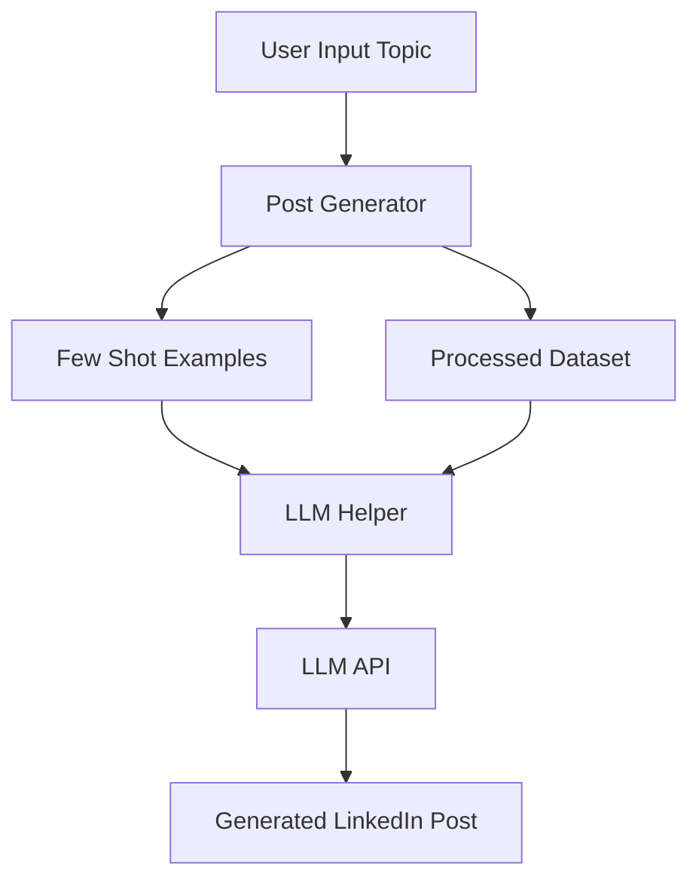
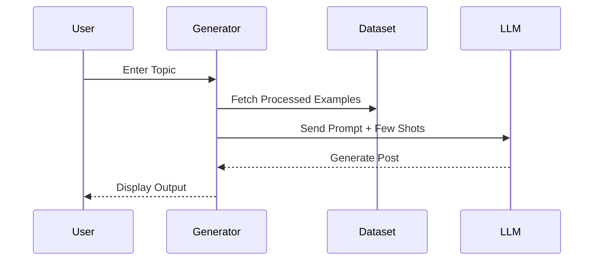

# LinkedIn Post Generator  
### Generate High-Impact LinkedIn Content Using LLMs

> Transform simple ideas into powerful, engaging LinkedIn posts using LLM model + Few-Shot Prompt Engineering.

---


---

## Project Overview

LinkedIn Post Generator built using **Python** and **Large Language Models (LLMs)**.

This project demonstrates:

- Prompt Engineering  
- Few-Shot Learning  
- Data Preprocessing  
- LLM Integration  
- Modular Backend Architecture  

It generates structured, human-like LinkedIn posts ready for publishing.

---

# System Architecture



This project can also be run using a Streamlit web interface.  
Instead of running from the terminal, you can generate LinkedIn posts directly from your browser.

---

## Installation

### 1. Install Streamlit

```bash
pip install streamlit
```

### 2. Install Required Dependencies

```bash
pip install openai python-dotenv
```

Or if you have a requirements file:

```bash
pip install -r requirements.txt
```

---

## Running the Application

If your Streamlit file is named `app.py`, run:

```bash
streamlit run app.py
```

If your file is named `main.py`, run:

```bash
streamlit run main.py
```

After running the command, a browser window will open automatically where you can enter a topic and generate a LinkedIn post.

---

## Example Streamlit App (app.py)

If you do not already have a Streamlit file, create one named `app.py` with the following content:

```python
import streamlit as st
from post_generator import generate_post

st.title("AI LinkedIn Post Generator")

topic = st.text_input("Enter your topic")

if st.button("Generate Post"):
    if topic:
        post = generate_post(topic)
        st.write(post)
    else:
        st.warning("Please enter a topic")
```

Then run:

```bash
streamlit run app.py
```

---

## Environment Configuration

Create a `.env` file in the project root directory and add your API key:

```
OPENAI_API_KEY=your_api_key_here
```

Make sure `.env` is included in your `.gitignore`.

---

## Quick Start Command

You can run everything with:

```bash
pip install streamlit openai python-dotenv
streamlit run app.py
```

---

Now your AI LinkedIn Post Generator works in:

- Terminal mode  
- Streamlit web interface mode  

---

# Project Structure

```
linkedin-post-generator/
│
├── main.py                 # Application entry point
├── post_generator.py       # Core generation logic
├── llm_helper.py           # LLM integration & prompt handling
├── preprocess.py           # Data cleaning pipeline
├── few_shots.py            # Few-shot training examples
│
├── raw_posts.json          # Raw LinkedIn posts dataset
├── processed_posts.json    # Clean structured dataset
│
├── .env                    # Environment variables (API keys)
└── README.md
```

---

# Tech Stack

| Technology | Purpose |
|------------|----------|
| Python  | Core Development |
| LLM API  | Content Generation |
| JSON  | Dataset Storage |
| python-dotenv  | Secure API Management |
| Prompt Engineering  | Content Optimization |

---

# Key Features

LLM Based (llama) generated LinkedIn posts  
Few-shot learning for improved tone & structure  
Clean preprocessing pipeline  
Modular & scalable architecture  
Secure API key handling  
Easily extendable into SaaS product  

---

# Installation Guide

## Clone Repository

```bash
git clone https://github.com/your-username/linkedin-post-generator.git
cd linkedin-post-generator
```

---

##  Create Virtual Environment

```bash
python -m venv venv
```

Activate:

**Windows**
```
venv\Scripts\activate
```

**Mac/Linux**
```
source venv/bin/activate
```

---

## Install Dependencies

```bash
pip install -r requirements.txt
```

If requirements file not available:

```bash
pip install openai python-dotenv
```

---

# Environment Setup

Create a `.env` file in root directory:

```
OPENAI_API_KEY=your_api_key_here
```

 Never upload `.env` to GitHub.

---

# How To Run

### Step 1 (Optional): Preprocess Dataset

```bash
python preprocess.py
```

### Step 2: Generate LinkedIn Post

```bash
python main.py
```

LinkedIn post will appear in your terminal.

---

# How It Works

1. Raw posts stored in `raw_posts.json`
2. Preprocessing cleans and structures data
3. Few-shot examples guide writing tone
4. Prompt sent to LLM API
5. AI generates structured LinkedIn post
6. Final output displayed

---

# Data Flow Visualization



---

# Example Output

```
I used to think consistency was overrated.

Until I realized something powerful:

Success isn’t about intensity.
It’s about repetition.

You don’t need 1000 hours of motivation.
You need 1 hour of discipline — daily.

Here’s what changed my mindset 👇
...
```

---

# Use Cases

- Personal Branding Automation  
- LinkedIn Ghostwriting Backend  
- AI SaaS MVP  
- Developer Portfolio Project  
- Content Automation Tool  

---

# Future Improvements

- Streamlit Web Interface  
- Multiple Writing Tones (Professional, Storytelling, Viral)  
- Hashtag Generator  
- Post Scheduling Integration  
- Database Storage  
- Analytics Dashboard  

---

# Why This Project Stands Out

Demonstrates Prompt Engineering skills  
Shows real LLM API integration  
Clean modular architecture  
Recruiter-friendly structure  
Expandable to production-level SaaS  

---

# Contributing

1. Fork repository  
2. Create feature branch  
3. Commit changes  
4. Push branch  
5. Open Pull Request  

---


# About Me:

Name  Chidatma Patel
<br>
LinkedIn: www.linkedin.com/in/chidatmapatel2007
<br>
Email: patelchidatma@gmail.com

---

⭐ If you found this project useful, consider giving it a star!
